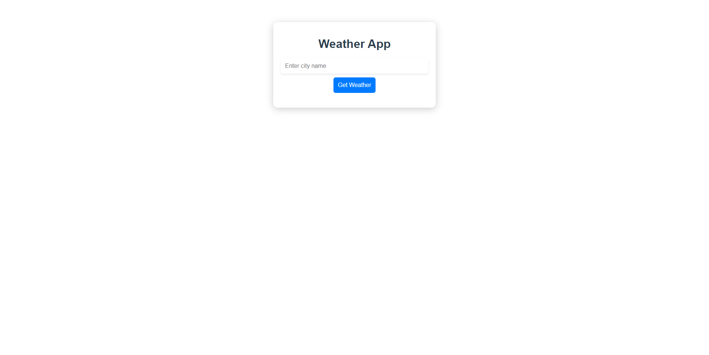
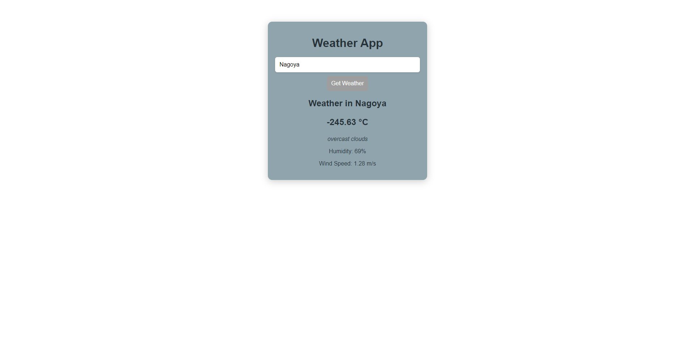
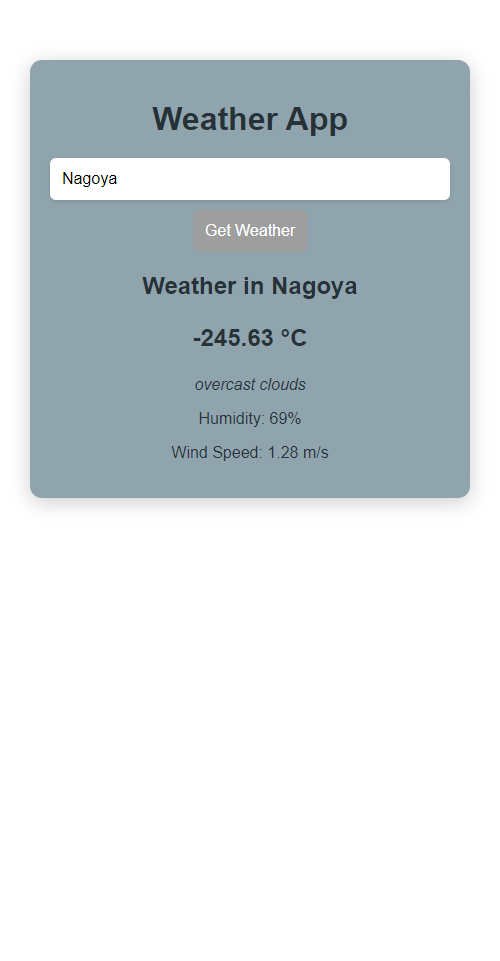
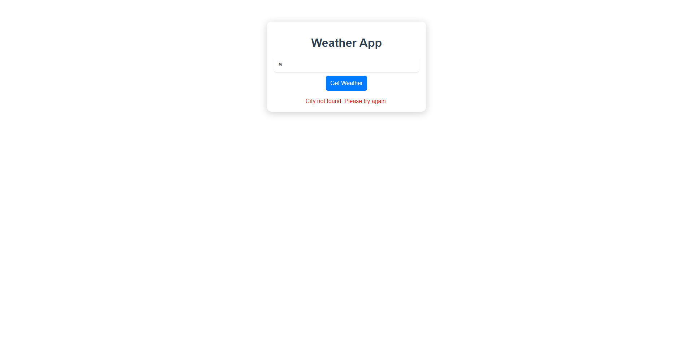

# weather-app

## Overview

The Weather App is a simple web application built with Laravel that provides users with real-time weather information based on their location.

## Features

- Search for weather by city name
- Display current temperature, humidity, and wind speed

## Tech Stack

- **Frontend:** Vuejs
- **API:** Laravel api: https://github.com/crsdngnn/weather-app-api
- 
## Screenshot





## Installation

### Prerequisites

- Node.js (>= 14.x)
- npm or yarn

### Steps

1. **Clone the repository:**

   ```bash
   git clone https://github.com/crsdngnn/weather-app.git
   cd weather-app
   
2. **Create .env file:**

   ```bash
   touch .env

3. **Add api url for backend in the .env file:**
   ```bash
   VUE_APP_API_URL='http://localhost:8000/api'

4. **Install dependencies**
   ```bash
   npm install

5. **Install dependencies**
   ```bash
   npm run serve
